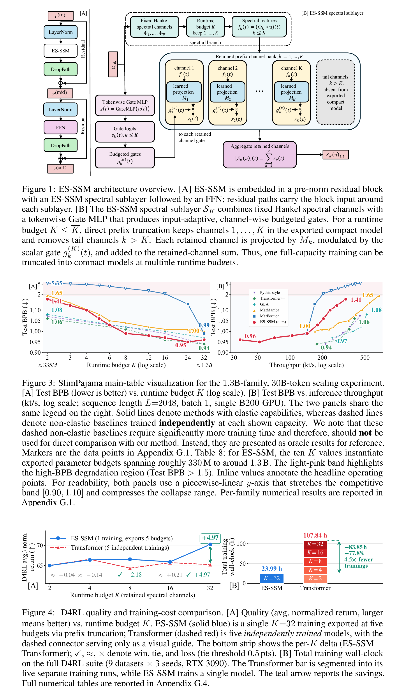

# ES-SSM

**Elastic Spectral State Space Models for Train-Once Budgeted Inference**

[Paper: arXiv:2601.22488](https://arxiv.org/abs/2601.22488) | [Citation](#citation)

Modern sequence models are typically trained at a fixed computational capacity. However, real-world applications require AI deployment across heterogeneous computational platforms, from high-throughput cloud clusters to compute-limited endpoints and power-constrained edge devices.

ES-SSM studies elasticity from an operator-approximation perspective: it controls the approximation resolution of the SSM sequence operator, rather than only shrinking architectural components.

## Method

ES-SSM is a train-once, export-many sequence modeling framework that gains elasticity through spectral approximation of the SSM sequence operator. Fixed Hankel spectral channels define an operator-level approximation resolution. Input-adaptive channel-wise gates and budget dropout train the same spectral prefixes that compact models use at inference time.

At deployment, direct prefix truncation keeps channels 1 through K and removes the tail channels. One full-capacity checkpoint can therefore produce smaller models across runtime budgets, without budget-specific retraining, channel search, or reordering.



## Results

Evaluations cover byte-level language modeling, Long Range Arena, Speech Commands V2, D4RL offline reinforcement learning, and a byte-level generality check.

On the 1.3B-family, 30B-token SlimPajama experiment, one training run exports ten budgets spanning roughly 330M to 1.3B parameters, with a smooth quality-cost curve and no abrupt low-budget collapse.

On D4RL (9 datasets x 3 seeds, RTX 3090), one ES-SSM training run provides five deployment budgets in 23.99 h, versus 107.84 h for five independently trained Transformer models, a 77.8% reduction. Returns match at K=2, 4, and 16, and improve at K=8 and 32.

## Future direction

A potential direction is larger knowledge-intensive AI agents, including robotic systems, that need to run across heterogeneous compute and power budgets. Larger-scale training is future work.

## Repository

The current repository includes a PG-19 experiment notebook: [ES-SSM_PG19.ipynb](ES-SSM_PG19.ipynb). The full training and evaluation code will be added in a later update.

## Citation

If you use this work, please cite:

```bibtex
@misc{song2026elasticspectralstatespace,
  title={Elastic Spectral State Space Models for Train-Once Budgeted Inference},
  author={Dachuan Song and Junyu Yin and Zechen Hu and Xuan Wang},
  year={2026},
  eprint={2601.22488},
  archivePrefix={arXiv},
  primaryClass={cs.LG},
  url={https://arxiv.org/abs/2601.22488},
}
```
