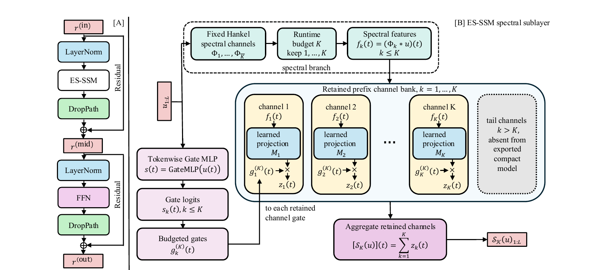
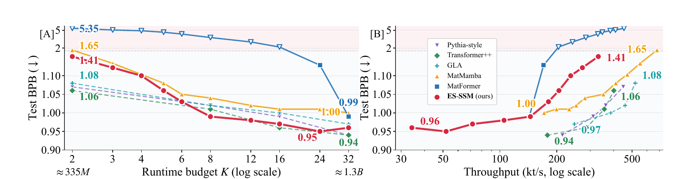
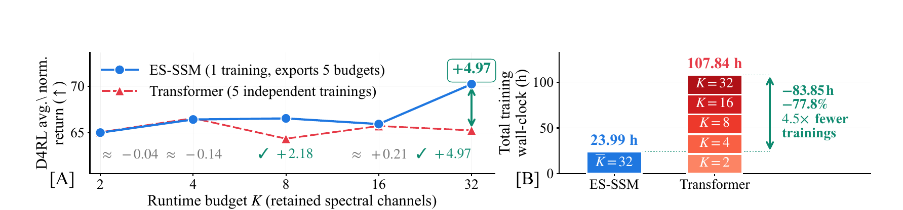

# ES-SSM

**Elastic Spectral State Space Models for Train-Once Budgeted Inference**

[Paper: arXiv:2601.22488](https://arxiv.org/abs/2601.22488) | [Code](#code) | [Hybrid follow-up](https://arxiv.org/abs/2609.32486) | [Citation](#citation)

Modern sequence models are typically trained at a fixed computational capacity. However, real-world applications require AI deployment across heterogeneous computational platforms, from high-throughput cloud clusters to compute-limited endpoints and power-constrained edge devices.

ES-SSM studies elasticity from an operator-approximation perspective: it controls the approximation resolution of the SSM sequence operator, rather than only shrinking architectural components.

## Method

ES-SSM is a train-once, export-many sequence modeling framework that gains elasticity through spectral approximation of the SSM sequence operator. Fixed Hankel spectral channels define an operator-level approximation resolution. Input-adaptive channel-wise gates and budget dropout train the same spectral prefixes that compact models use at inference time.

At deployment, direct prefix truncation keeps channels 1 through K and removes the tail channels. One full-capacity checkpoint can therefore produce smaller models across runtime budgets, without budget-specific retraining, channel search, or reordering.



**Figure 1.** ES-SSM architecture overview. Fixed Hankel spectral channels and a tokenwise Gate MLP produce input-adaptive, channel-wise budgeted gates. Thus, one full-capacity training can be truncated into compact models at multiple runtime budgets.

## Results

Evaluations cover byte-level language modeling, Long Range Arena, Speech Commands V2, D4RL offline reinforcement learning, and a byte-level generality check.

On SlimPajama (1.3B family, 30B tokens), ES-SSM produces a smooth, usable budget curve from one full-capacity training run; even the smallest prefixes remain outside the collapse zone. Ten exported parameter budgets span roughly 330M to 1.3B.



**Figure 3.** SlimPajama main-table visualization for the 1.3B-family, 30B-token experiment. [A] Test BPB vs runtime budget K. [B] Test BPB vs throughput at sequence length 2048, batch 1, on one B200 GPU. Dashed non-elastic baselines are independently trained oracles, not intended for direct comparison with ES-SSM.

On D4RL (9 datasets x 3 seeds, RTX 3090), ES-SSM obtains all five budgets from one run and reduces total training wall-clock from 107.84 h to 23.99 h (77.8%). Returns match the independently trained Transformer at K=2, 4, and 16, and improve at K=8 and 32.



**Figure 4.** [A] Average normalized return vs runtime budget. [B] Total training wall-clock on the full D4RL suite (9 datasets x 3 seeds, RTX 3090).

## Future work

For hybrid architectures, see our follow-up paper, [Elastic Selective Spectral Hybrids for Train-Once, Export-Many Budgeted Inference](https://arxiv.org/abs/2609.32486).

We are also pursuing an attention-free state-space model with strong retrieval, recall, and general sequence-modeling capabilities.

## Code

This repository contains the code accompanying this paper.

## Citation

If you use this work, please cite:

```bibtex
@misc{song2026elasticspectralstatespace,
  title={Elastic Spectral State Space Models for Train-Once Budgeted Inference},
  author={Dachuan Song and Junyu Yin and Zechen Hu and Xuan Wang},
  year={2026},
  eprint={2601.22488},
  archivePrefix={arXiv},
  primaryClass={cs.LG},
  url={https://arxiv.org/abs/2601.22488},
}

@misc{song2026elasticselectivespectralhybrids,
  title={Elastic Selective Spectral Hybrids for Train-Once, Export-Many Budgeted Inference},
  author={Dachuan Song and Chuchu Chen and Xuan Wang},
  year={2026},
  eprint={2609.32486},
  archivePrefix={arXiv},
  primaryClass={cs.LG},
  url={https://arxiv.org/abs/2609.32486},
}
```
